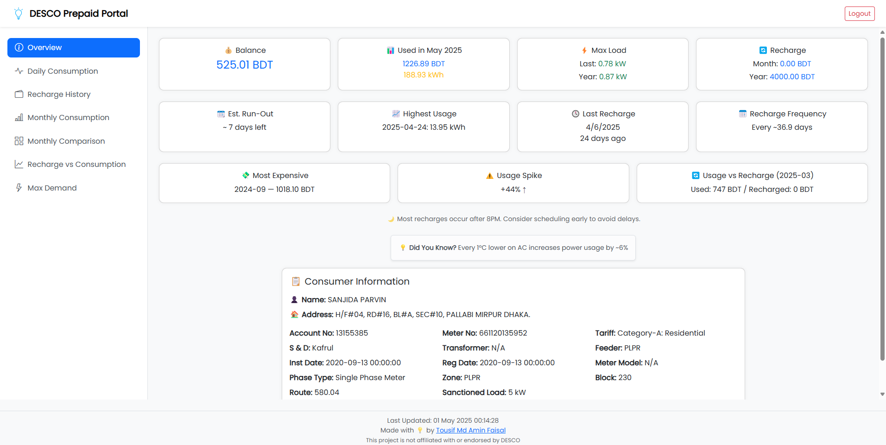

# 🔌 DESCO Prepaid Consumer Dashboard (Unofficial)

A modern, mobile-friendly dashboard that helps DESCO prepaid consumers visualize and manage their electricity usage with real insights.

> ⚠️ This is an unofficial tool. It is **not affiliated with or endorsed by DESCO**. Built purely for consumer awareness and educational purposes.

---

## 🌐 Live Demo

👉 [https://faisalnabil.github.io/desco-dashboard](#)

---

## 📸 Preview

  
_A screenshot of the main dashboard interface_

---

## 🔥 Features

- 📊 **Live Daily Usage Graphs**  
  View your electricity consumption per day (kWh and BDT)

- 📅 **Monthly Consumption vs Recharge Trend**  
  Visualize how much you used vs how much you recharged

- ⚖️ **Balance Overview & Projected Run-Out Days**  
  Know how many days your balance may last based on recent usage

- 🚨 **High Usage Detection & Spike Alerts**  
  Instantly see if your usage spiked compared to last week

- 📈 **Highest Usage Day**  
  Identify your peak usage day this month

- 💸 **Most Expensive Month Highlighted**

- 🔁 **Recharge Frequency Tracker**  
  Learn how often you recharge on average

- 🌙 **Off-Peak Recharge Tip**  
  Get friendly tips if you mostly recharge at night

- 🔁 **Rotating "Did You Know?" Energy Facts**  
  Learn smart usage tips every 12 seconds

- 👥 **Recent Login Accounts (LocalStorage)**  
  Quickly log in to your most used accounts

- 💾 **No backend** – all runs client-side and data is fetched live from official APIs

---

## 📦 Tech Stack

- HTML + CSS (Bootstrap 5)
- JavaScript (jQuery)
- Chart.js + ChartDataLabels
- Google Fonts (Poppins)
- LocalStorage API
- GitHub Pages

---

## 📂 Project Structure

```
📁 css/
    └── style.css
📁 js/
    ├── app-init.js
    └── sections/
        ├── overview.js
        ├── daily.js
        ├── monthly.js
        ├── rvc.js
        ├── comparison.js
        └── demand.js
📁 assets/
    ├── logo.png
    └── favicon.ico
index.html
dashboard.html
README.md
```

---

## ⚙️ Getting Started

1. **Clone this repo**  
   ```bash
   git clone https://github.com/FaisalNabil/desco-dashboard.git
   cd desco-dashboard
   ```

2. **Open in your browser**  
   Just open `index.html` — no server needed.

3. **Or deploy on GitHub Pages**  
   - Push to GitHub
   - Go to repo → Settings → Pages → Select root folder + `main` branch

---

## 🔐 Data Privacy

All data is fetched **directly from official DESCO APIs**.  
✅ No data is stored on any third-party server  
✅ No analytics, tracking, or cookies  
✅ Everything stays in your browser (LocalStorage)

---

## 🚧 Roadmap

- [x] Overview with smart insights
- [x] Daily, monthly and comparison charts
- [x] Recharge behavior analytics
- [x] Recent account login shortcut
- [ ] Export charts to Excel/PDF
- [ ] Dark mode toggle
- [ ] Offline cache mode (PWA)

---

## 🤝 Contributing

Contributions, ideas, and bug reports are welcome!  
Open a pull request or issue on GitHub.

---

## 🧑‍💻 Author

Made with 💡 by [Tousif Md Amin Faisal](https://www.linkedin.com/in/tousif-md-amin-faisal/)  
📫 Email: tousif.faisal@gmail.com

---

## 📄 License

This project is licensed under the MIT License.

---

## ⭐️ If You Found This Helpful...

Star the repo ⭐ | Share with friends 📣 | Suggest ideas 💡
